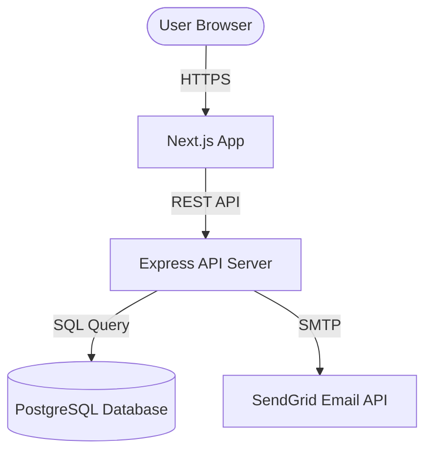
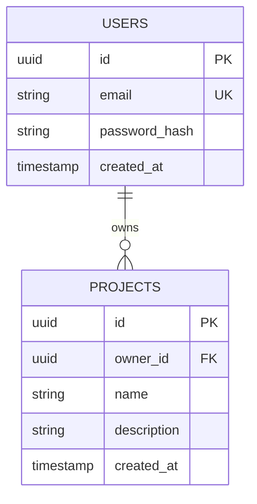

# 📐 Solution Architect: System Architecture & Design

◀️ Back to [[00_Project_Hub]] | Requirements: [[business_requirements]]

This document outlines the technical design, data schema, system interactions, and architectural decisions.

---

## 🛠️ Technology Stack & Decisions

| Layer | Technology | Rationale |
| :--- | :--- | :--- |
| **Frontend** | React / Next.js | Server-side rendering, dynamic Routing, performance. |
| **Backend** | Node.js / Express | Fast execution, unified language, rich package ecosystem. |
| **Database** | PostgreSQL | Relational consistency, rich JSON data types. |
| **Styling** | Vanilla CSS | Custom design systems, zero compilation baggage. |

---

## 🏗️ System Components Diagram
*Visual representation of how modules communicate.*



---

## 🗄️ Data Model / Entity Relationship Diagram (ERD)
*Define tables, fields, types, and relations.*



---

## 🔌 API Contracts (Endpoints)
*Interface specs for frontend-backend communication.*

### `POST /api/v1/auth/login`
- **Description**: Authenticate user and issue JWT.
- **Request Body**:
  ```json
  {
    "email": "user@example.com",
    "password": "securepassword123"
  }
  ```
- **Response (200 OK)**:
  ```json
  {
    "success": true,
    "token": "eyJhbGciOiJIUzI1NiIsIn...",
    "user": {
      "id": "a1b2c3d4...",
      "email": "user@example.com"
  }
  ```

---

## 🪵 Architectural Decision Records (ADR)
*Log of key architecture decisions to prevent backtracking.*

### ADR-01: Use JWT for Session Management
- **Status**: `Accepted`
- **Context**: We need stateless session verification for performance and scalability.
- **Decision**: Authenticate via JWT, store token in HTTP-only cookies to prevent XSS.
- **Consequences**: No server-side session lookup needed, but token revocation requires blacklisting.
